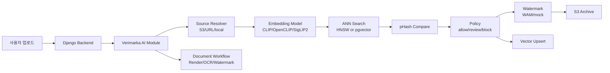

# Verimarka AI Module

AI 저작물 등록 가능성 판정, 이미지/문서 워터마크 삽입 및 검출, 벡터 인덱싱, OCR 기반 문서 요약을 담당하는 Verimarka AI 모듈입니다.

이 저장소는 Django 백엔드 전체가 아니라, 백엔드에서 호출하는 AI 처리 계층을 독립적으로 정리한 코드입니다. Django 백엔드에서 Python 함수로 직접 import해 호출할 수도 있도록 계약 모델을 분리했습니다.

## 1. 프로젝트 한 줄 소개

Verimarka AI Module은 사용자가 등록하려는 이미지와 문서를 분석해 `allow`, `review`, `block` 상태를 판정하고, 등록 가능한 자산에는 워터마크와 벡터 검색 정보를 생성해 이후 검증 흐름에 연결하는 AI 처리 모듈입니다.

## 2. 개발 배경

AI 생성 이미지와 문서는 원본성, 중복 등록, 등록 시점을 서비스 안에서 함께 다뤄야 합니다. 단순 업로드 저장만으로는 이미 등록된 이미지와의 유사성, 워터마크 존재 여부, 문서의 주요 필드 검증을 판단하기 어렵기 때문에 별도의 AI 처리 계층을 두었습니다.

이미지 임베딩, ANN 검색, pHash 비교, WAM 기반 워터마크, 문서 렌더링, CLOVA OCR 연동, S3/pgvector 연동을 하나의 계약으로 묶어 백엔드가 안정적으로 호출할 수 있게 설계했습니다.

## 3. 주요 기능

| 영역 | 기능 |
| --- | --- |
| 이미지 유사도 분석 | SigLIP2 임베딩 생성, cosine 기반 Top-K 검색, pHash 거리 비교 |
| 등록 정책 판정 | 유사도와 pHash 기준으로 `allow`, `review`, `block` 판정 및 후속 액션 반환 |
| 벡터 인덱싱 | 로컬 HNSW 인덱스 생성/로드, DB manifest 기반 변경 감지, PostgreSQL pgvector 검색/업서트 |
| 워터마크 삽입 | Meta WAM 백엔드 기반 이미지 워터마크 삽입, payload bit/id 생성, mock 백엔드 제공 |
| 워터마크 검출 | WAM 또는 mock 백엔드로 워터마크 검출, confidence/bit accuracy/payload 결과 반환 |
| 이미지 등록 워크플로우 | 원본 보관, 등록 가능성 판정, 워터마크 결과 보관, 벡터 업서트 후속 액션 제어 |
| 문서 처리 | PDF/DOC/DOCX/이미지 입력 렌더링, 페이지별 워터마크 삽입/검출, 워터마크본 PDF 생성 |
| 문서 OCR | CLOVA OCR 호출, 표준 근로계약서 기준 대표자/근로자/작성일 필드 추출 |
| 스토리지 연동 | S3 key/S3 URI/URL/local path 입력 처리, 원본/결과/거절 파일 S3 아카이빙 |
| 백엔드 연동 | Django direct import용 Pydantic 계약 모델 제공 |

## 4. 기술 스택

| 구분 | 사용 기술 |
| --- | --- |
| Interface/Contract | Python function-call interface, Pydantic v2 |
| Image Embedding | SigLIP2 |
| Vector Search | hnswlib, PostgreSQL pgvector |
| Image Similarity | cosine similarity, ImageHash pHash |
| Watermark | Meta Watermark Anything Model(WAM), PyTorch, torchvision, mock backend |
| Document Processing | PyMuPDF, Pillow, LibreOffice 변환 옵션 |
| OCR | CLOVA OCR HTTP API, requests |
| Storage/DB | boto3 S3 client, psycopg, S3-compatible object storage |
| Runtime | Python, NumPy, pandas, uvicorn |

## 5. AI 처리 구조



이미지 등록은 임베딩 검색과 pHash 비교를 먼저 수행한 뒤 정책 결과를 반환합니다. `allow`인 경우 워터마크 삽입과 벡터 업서트까지 이어지고, `review` 또는 `block`인 경우 백엔드가 투표/검토/거절 흐름을 선택할 수 있도록 결과와 후보 정보를 반환합니다.

문서 등록/검증은 이미지와 다른 워크플로우로 분리했습니다. 문서를 페이지 이미지로 렌더링한 뒤 페이지별 워터마크를 삽입하거나 검출하고, OCR 결과에서 최소 요약 필드를 추출해 서비스 검증 보조 정보로 제공합니다.

## 6. 백엔드 연동 함수 계약

이 모듈은 별도 API 서버를 주력으로 두기보다, Django 백엔드에서 Python 함수로 직접 import해 호출하는 방식으로 연동했습니다.  
입출력 구조는 Pydantic 모델로 정의해 백엔드와 AI 모듈 사이의 데이터 계약을 고정했습니다.

| 구분 | 함수 | 설명 |
| --- | --- | --- |
| 이미지 등록 판정 | `run_guard_v1` | 입력 이미지의 SigLIP2 임베딩 검색, pHash 비교, `allow/review/block` 정책 판정 |
| 이미지 등록 워크플로우 | `run_register_workflow_v1` | 원본 보관, 등록 가능성 판정, 워터마크 삽입, 벡터 업서트 후속 액션 반환 |
| 원본/결과 보관 | `archive_image_v1` | 등록 요청 원본, 워터마크 결과, 거절 이미지 등을 S3에 저장 |
| 벡터 업서트 | `upsert_vector_embedding_v1` | 이미지 임베딩과 pHash를 pgvector 테이블에 저장 |
| 문서 등록 워크플로우 | `run_document_register_workflow_v1` | 문서 렌더링, 페이지 워터마크 삽입, OCR 요약 필드 추출 |
| 문서 검증 워크플로우 | `run_document_verify_workflow_v1` | 문서 페이지 워터마크 검출, OCR 요약, 검증 후속 액션 반환 |
| 워터마크 삽입/검출 | `WatermarkService.embed`, `WatermarkService.detect` | WAM/mock 백엔드를 통한 이미지 워터마크 삽입 및 검출 |

백엔드 연동 예시는 다음과 같습니다.

```python
from app.guard_service import run_guard_v1
from app.register_workflow_service import run_register_workflow_v1
from app.persist_service import archive_image_v1, upsert_vector_embedding_v1
from app.document.workflow_service import (
    run_document_register_workflow_v1,
    run_document_verify_workflow_v1,
)
from app.watermark.service import WatermarkService
```

## 7. 저장소 구조

```text
img_guard/
  app/
    config.py                      # 모델, 인덱스, S3, DB, 워터마크 설정
    embedder.py                    # SigLIP2 중심 이미지 임베딩
    ann_index.py                   # HNSW/pgvector 검색
    guard_service.py               # 이미지 분석 및 정책 판정
    register_workflow_service.py   # 이미지 등록 워크플로우
    persist_service.py             # S3 보관 및 vector upsert
    policy.py                      # allow/review/block 판정 정책
    source_io.py                   # S3/URL/local 입력 정규화
    document/                      # 문서 렌더링, OCR, 워터마크 워크플로우
    watermark/                     # WAM/mock 워터마크 서비스
  scripts/
    setup_vector_db.py             # pgvector 테이블 확인/부트스트랩
    preload_vectors_from_dir.py    # 이미지 디렉터리 벡터 사전 적재
    preflight_runtime.py           # S3/pgvector 런타임 점검
  sql/
    bootstrap_pgvector.sql         # pgvector 스키마 초기화
```

## 8. 역할 분담

| 이름 | 역할 |
| --- | --- |
| 박준서 | AI 모델/분석 모듈 담당. SigLIP2 이미지 임베딩, 유사도 판정, 벡터 인덱싱, 워터마크 삽입/검출, 문서 OCR/워터마크 워크플로우 구현 |
| 백엔드 담당 | Django API, 사용자 인증, 콘텐츠 관리, Celery 작업, 프론트 연동, 운영 배포 흐름 |
| 블록체인 담당 | NFT/토큰 발급, 컨트랙트, 지갑 및 온체인 검증 흐름 |

## 9. 기술적으로 고민한 점

| 고민 | 해결 방향 | 구현 포인트 |
| --- | --- | --- |
| 단순 이미지 업로드만으로는 기존 등록 이미지와의 유사성을 판단하기 어려움 | SigLIP2 임베딩 기반 의미 유사도 검색을 적용 | 입력 이미지를 임베딩한 뒤 cosine similarity 기반 Top-K 검색 수행 |
| cosine similarity만으로는 중복/유사 이미지 판정이 불안정함 | 임베딩 검색 후 pHash 거리까지 함께 비교 | 의미 유사도와 픽셀 유사도를 함께 사용해 `allow/review/block` 정책 구성 |
| 로컬 개발과 서비스 환경의 벡터 검색 방식이 다름 | 로컬 HNSW와 pgvector 백엔드를 모두 지원 | `ANN_BACKEND=local/pgvector`로 전환하고 동일한 결과 계약으로 처리 |
| 임베딩 모델과 벡터 인덱스의 차원 호환성이 중요함 | SigLIP2 임베딩 차원을 기준으로 인덱스와 pgvector 테이블을 맞춤 | manifest에 `embed_model`, `embed_dim`을 저장하고 호환되지 않으면 rebuild |
| WAM 모델은 의존성과 weight가 무겁고 배포에 부담이 큼 | 실제 WAM 백엔드와 계약 테스트용 mock 백엔드를 분리 | `WM_BACKEND=mock`으로 백엔드 연동을 먼저 검증하고, 운영에서 WAM repo/checkpoint를 별도 마운트 |
| 백엔드가 로컬 파일 경로에 의존하면 worker/서버 환경에서 깨질 수 있음 | S3 key, S3 URI, URL, local path를 모두 동일 입력 계약으로 처리 | 입력 소스를 로컬 캐시로 정규화한 뒤 AI 처리 수행 |
| 문서는 이미지와 처리 단위가 달라 같은 로직으로 묶기 어려움 | 문서 전용 workflow를 분리 | PDF/DOC/DOCX를 페이지 이미지로 렌더링하고 페이지별 워터마크/OCR 결과를 요약 |


## 10. 환경변수와 제외 파일

주요 환경변수는 `img_guard/.env.example`을 기준으로 설정합니다.

| 구분 | 변수 |
| --- | --- |
| 모델 | `EMBED_MODEL`, `EMBED_DEVICE`, `ANN_BACKEND`, `WM_BACKEND` |
| S3 | `S3_DEFAULT_BUCKET`, `AWS_REGION`, `S3_ENDPOINT_URL` |
| DB/pgvector | `DB_NAME`, `DB_USER`, `DB_PASSWORD`, `DB_HOST`, `VECTOR_DSN`, `VECTOR_TABLE` |
| WAM | `WAM_REPO_DIR`, `WAM_PARAMS_PATH`, `WAM_CHECKPOINT_PATH` |
| OCR | `CLOVA_OCR_INVOKE_URL`, `CLOVA_OCR_SECRET`, `DOC_RENDER_DPI`, `DOC_MAX_PAGES` |

다음 파일은 저장소에 포함하지 않습니다.

- `.env`, `*.p8`, `*.pem`, `*.key`
- `.venv/`, `__pycache__/`
- `img_guard/data/`
- `img_guard/models/wam/*.pth`
- `img_guard/third_party/watermark-anything/`
- 로컬 발표 자료, 개발 메모, 개인 설정 파일

