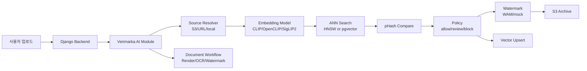

# Verimarka AI Module

AI 저작물 등록 가능성 판정, 이미지/문서 워터마크 삽입 및 검출, 벡터 인덱싱, OCR 기반 문서 요약을 담당하는 Verimarka AI 모듈입니다.

이 저장소는 Django 백엔드 전체가 아니라, 백엔드에서 호출하는 AI 처리 계층을 독립적으로 정리한 코드입니다. FastAPI로 실행할 수도 있고, Django 백엔드에서 Python 함수로 직접 import해 호출할 수도 있도록 계약 모델을 분리했습니다.

## 1. 프로젝트 한 줄 소개

Verimarka AI Module은 사용자가 등록하려는 이미지와 문서를 분석해 `allow`, `review`, `block` 상태를 판정하고, 등록 가능한 자산에는 워터마크와 벡터 검색 정보를 생성해 이후 검증 흐름에 연결하는 AI 처리 모듈입니다.

## 2. 개발 배경

AI 생성 이미지와 문서는 원본성, 중복 등록, 소유권 검증을 서비스 안에서 함께 다뤄야 합니다. 단순 업로드 저장만으로는 이미 등록된 이미지와의 유사성, 워터마크 존재 여부, 문서의 주요 필드 검증을 판단하기 어렵기 때문에 별도의 AI 처리 계층을 두었습니다.

이 모듈은 백엔드 API 요청과 분리된 AI 로직을 담당합니다. 이미지 임베딩, ANN 검색, pHash 비교, WAM 기반 워터마크, 문서 렌더링, CLOVA OCR 연동, S3/pgvector 연동을 하나의 계약으로 묶어 백엔드가 안정적으로 호출할 수 있게 설계했습니다.

## 3. 주요 기능

| 영역 | 기능 |
| --- | --- |
| 이미지 유사도 분석 | CLIP/OpenCLIP/SigLIP2 임베딩 생성, cosine 기반 Top-K 검색, pHash 거리 비교 |
| 등록 정책 판정 | 유사도와 pHash 기준으로 `allow`, `review`, `block` 판정 및 후속 액션 반환 |
| 벡터 인덱싱 | 로컬 HNSW 인덱스 생성/로드, DB manifest 기반 변경 감지, PostgreSQL pgvector 검색/업서트 |
| 워터마크 삽입 | Meta WAM 백엔드 기반 이미지 워터마크 삽입, payload bit/id 생성, mock 백엔드 제공 |
| 워터마크 검출 | WAM 또는 mock 백엔드로 워터마크 검출, confidence/bit accuracy/payload 결과 반환 |
| 이미지 등록 워크플로우 | 원본 보관, 등록 가능성 판정, 워터마크 결과 보관, 벡터 업서트 후속 액션 제어 |
| 문서 처리 | PDF/DOC/DOCX/이미지 입력 렌더링, 페이지별 워터마크 삽입/검출, 워터마크본 PDF 생성 |
| 문서 OCR | CLOVA OCR 호출, 표준 근로계약서 기준 대표자/근로자/작성일 필드 추출 |
| 스토리지 연동 | S3 key/S3 URI/URL/local path 입력 처리, 원본/결과/거절 파일 S3 아카이빙 |
| 백엔드 연동 | FastAPI REST 엔드포인트와 Django direct import용 Pydantic 계약 모델 제공 |

## 4. 기술 스택

| 구분 | 사용 기술 |
| --- | --- |
| API/Contract | FastAPI, Pydantic v2 |
| Image Embedding | open_clip, CLIP ViT-B/32, OpenCLIP ViT-H/14, SigLIP2 |
| Vector Search | hnswlib, PostgreSQL pgvector |
| Image Similarity | cosine similarity, ImageHash pHash |
| Watermark | Meta Watermark Anything Model(WAM), PyTorch, torchvision, mock backend |
| Document Processing | PyMuPDF, Pillow, LibreOffice 변환 옵션 |
| OCR | CLOVA OCR HTTP API, requests |
| Storage/DB | boto3 S3 client, psycopg, S3-compatible object storage |
| Runtime | Python, NumPy, pandas, uvicorn |

## 5. AI 처리 구조



이미지 등록은 임베딩 검색과 pHash 비교를 먼저 수행한 뒤 정책 결과를 반환합니다. `allow`인 경우 워터마크 삽입과 벡터 업서트까지 이어지고, `review` 또는 `block`인 경우 백엔드가 투표/검토/거절 흐름을 선택할 수 있도록 결과와 후보 정보를 반환합니다.

문서 등록/검증은 이미지와 다른 워크플로우로 분리했습니다. 문서를 페이지 이미지로 렌더링한 뒤 페이지별 워터마크를 삽입하거나 검출하고, OCR 결과에서 최소 요약 필드를 추출해 서비스 검증 보조 정보로 제공합니다.

## 6. API 및 함수 계약

| 구분 | 경로/함수 | 설명 |
| --- | --- | --- |
| Health | `GET /health` | AI 모듈 상태 확인 |
| Image Guard | `POST /v1/guard/image` | 이미지 유사도 분석 및 정책 판정 |
| Archive | `POST /v1/assets/archive` | 원본/결과/거절 이미지 S3 보관 |
| Vector Upsert | `POST /v1/vector/upsert` | 이미지 임베딩과 pHash를 pgvector 테이블에 저장 |
| Register Workflow | `POST /v1/workflow/register` | 이미지 등록 전체 워크플로우 실행 |
| Watermark Embed | `POST /v1/watermark/embed` | 이미지 워터마크 삽입 |
| Watermark Detect | `POST /v1/watermark/detect` | 이미지 워터마크 검출 |
| Document Register | `POST /v1/workflow/document/register` | 문서 등록, 워터마크 삽입, OCR 요약 |
| Document Verify | `POST /v1/workflow/document/verify` | 문서 워터마크 검출 및 OCR 요약 |

Django 백엔드에서 HTTP 대신 직접 호출할 수 있도록 다음 함수 계약도 유지합니다.

```python
from app.register_workflow_service import run_register_workflow_v1
from app.document.workflow_service import (
    run_document_register_workflow_v1,
    run_document_verify_workflow_v1,
)
```

## 7. 저장소 구조

```text
img_guard/
  app/
    api.py                         # FastAPI 엔트리포인트
    config.py                      # 모델, 인덱스, S3, DB, 워터마크 설정
    embedder.py                    # CLIP/OpenCLIP/SigLIP2 임베딩
    ann_index.py                   # HNSW/pgvector 검색
    guard_service.py               # 이미지 분석 API 서비스
    register_workflow_service.py   # 이미지 등록 워크플로우
    persist_service.py             # S3 보관 및 vector upsert
    policy.py                      # allow/review/block 판정 정책
    document/                      # 문서 렌더링, OCR, 워터마크 워크플로우
    watermark/                     # WAM/mock 워터마크 서비스
  scripts/
    setup_vector_db.py             # pgvector 테이블 확인/부트스트랩
    preload_vectors_from_dir.py    # 이미지 디렉터리 벡터 사전 적재
    preflight_runtime.py           # S3/pgvector 런타임 점검
  sql/
    bootstrap_pgvector.sql         # pgvector 스키마 초기화
```

## 8. 역할 분담

| 이름 | 역할 |
| --- | --- |
| 박준서 | AI 모델/분석 모듈 담당. 이미지 임베딩, 유사도 판정, 벡터 인덱싱, 워터마크 삽입/검출, 문서 OCR/워터마크 워크플로우 구현 |
| 백엔드 담당 | Django API, 사용자 인증, 콘텐츠 관리, Celery 작업, 프론트 연동, 운영 배포 흐름 |
| 블록체인 담당 | NFT/토큰 발급, 컨트랙트, 지갑 및 온체인 검증 흐름 |

## 9. 기술적으로 고민한 점

| 고민 | 해결 방향 | 구현 포인트 |
| --- | --- | --- |
| 단순 cosine similarity만으로는 중복/유사 이미지 판정이 불안정함 | 이미지 임베딩 검색 후 pHash 거리까지 함께 비교 | `COS_BLOCK`, `COS_ALLOW`, `PHASH_BLOCK` 기준을 분리해 `allow/review/block` 정책 구성 |
| 로컬 개발과 서비스 환경의 벡터 검색 방식이 다름 | 로컬 HNSW와 pgvector 백엔드를 모두 지원 | `ANN_BACKEND=local/pgvector`로 전환하고, 동일한 `ANNResult` 계약으로 결과를 통일 |
| DB 이미지 순서가 바뀌면 인덱스 라벨이 틀어질 수 있음 | manifest에 상대 경로, 모델명, 차원, DB signature를 저장 | 데이터셋 변경 또는 모델 변경 시 자동 rebuild를 유도 |
| WAM 모델은 의존성과 weight가 무겁고 배포에 부담이 큼 | 실제 WAM 백엔드와 계약 테스트용 mock 백엔드를 분리 | `WM_BACKEND=mock` 기본값으로 API 계약을 먼저 검증하고, 운영에서 WAM repo/checkpoint를 별도 마운트 |
| 백엔드가 로컬 파일 경로에 의존하면 worker/서버 환경에서 깨질 수 있음 | S3 key, S3 URI, URL, local path를 모두 동일 입력 계약으로 처리 | `resolve_source_to_local`에서 입력 소스를 로컬 캐시로 정규화 |
| 문서는 이미지와 처리 단위가 달라 같은 로직으로 묶기 어려움 | 문서 전용 workflow를 분리 | PDF/DOC/DOCX를 페이지 이미지로 렌더링하고 페이지별 워터마크/OCR 결과를 요약 |
| OCR 결과를 법적 진위 판정으로 쓰면 위험함 | OCR은 검증 보조 정보로만 사용 | 대표자명, 근로자명, 작성일 추출 결과와 누락 필드를 반환하되 자동 차단 기준으로 사용하지 않음 |
| 민감정보와 대용량 모델/데이터가 Git에 섞일 위험이 있음 | `.env`, 인증키, data, WAM weight, third_party repo를 제외 | `.env.example`만 제공하고 런타임 파일은 로컬/서버에서 별도 주입 |

## 10. 트러블슈팅 / 성과

| 문제 | 원인 | 해결 |
| --- | --- | --- |
| 이미지 회전 정보 때문에 같은 이미지도 다르게 임베딩될 수 있음 | EXIF orientation이 모델 입력 전에 반영되지 않음 | 이미지 로딩 단계에서 EXIF orientation 보정 후 RGB 변환 |
| 임베딩 모델을 바꾸면 기존 HNSW 인덱스와 차원이 맞지 않음 | CLIP/OpenCLIP/SigLIP2의 embedding dimension이 서로 다름 | manifest에 `embed_model`, `embed_dim`을 저장하고 호환되지 않으면 rebuild |
| WAM 실모델 없이 백엔드 API 연동을 테스트하기 어려움 | WAM repo와 checkpoint가 크고 환경 의존성이 큼 | `MockWatermarkBackend`를 만들어 워터마크 API와 S3 흐름을 먼저 검증 |
| pgvector 검색 결과로 pHash를 계산하려면 원본 파일 접근이 필요함 | DB에는 vector와 S3 key 중심으로 저장됨 | S3 key/URL을 기반으로 후보 이미지를 캐시 다운로드해 pHash 비교 수행 |
| 문서 워터마크는 페이지별 결과가 필요함 | PDF/DOCX는 단일 이미지가 아니라 다중 페이지 자산 | 페이지별 PNG 렌더링 후 워터마크 삽입/검출 결과를 `page_results`로 반환 |
| OCR 누락이 곧 위변조 확정으로 오해될 수 있음 | OCR 정확도와 문서 품질에 따라 필드 추출 실패 가능 | 문서 상태를 `verified/review/failed`로 분리하고 OCR 누락은 review로 처리 |

## 11. 실행 방법

새로 clone한 뒤에는 기존 `.venv`를 복사하지 말고 fresh virtualenv를 만듭니다.

```bash
cd img_guard
python3 -m venv .venv
source .venv/bin/activate
python -m pip install -r requirements.cpu.txt
```

환경변수 템플릿을 복사합니다.

```bash
cp .env.example .env
```

FastAPI 서버 실행:

```bash
uvicorn app.api:app --host 0.0.0.0 --port 8000
```

Health check:

```bash
curl http://localhost:8000/health
```

런타임 점검:

```bash
python scripts/preflight_runtime.py
```

pgvector 초기화 확인:

```bash
python scripts/setup_vector_db.py
```

이미지 디렉터리 사전 적재:

```bash
python scripts/preload_vectors_from_dir.py --src-dir ./data/db_images/dataset60 --dry-run
```

## 12. 환경변수와 제외 파일

주요 환경변수는 `img_guard/.env.example`을 기준으로 설정합니다.

| 구분 | 변수 |
| --- | --- |
| 모델 | `EMBED_MODEL`, `EMBED_DEVICE`, `ANN_BACKEND`, `WM_BACKEND` |
| S3 | `S3_DEFAULT_BUCKET`, `AWS_REGION`, `S3_ENDPOINT_URL` |
| DB/pgvector | `DB_NAME`, `DB_USER`, `DB_PASSWORD`, `DB_HOST`, `VECTOR_DSN`, `VECTOR_TABLE` |
| WAM | `WAM_REPO_DIR`, `WAM_PARAMS_PATH`, `WAM_CHECKPOINT_PATH` |
| OCR | `CLOVA_OCR_INVOKE_URL`, `CLOVA_OCR_SECRET`, `DOC_RENDER_DPI`, `DOC_MAX_PAGES` |

다음 파일은 저장소에 포함하지 않습니다.

- `.env`, `*.p8`, `*.pem`, `*.key`
- `.venv/`, `__pycache__/`
- `img_guard/data/`
- `img_guard/models/wam/*.pth`
- `img_guard/third_party/watermark-anything/`
- 로컬 발표 자료, 개발 메모, 개인 설정 파일

## 13. 운영 참고

- `WM_BACKEND=mock`은 로컬 계약 테스트용입니다. 실제 워터마크 삽입/검출에는 `WM_BACKEND=wam`과 WAM repo/checkpoint가 필요합니다.
- 문서 DOC/DOCX 렌더링에는 서버에 LibreOffice가 필요합니다. PDF와 이미지 입력은 PyMuPDF/Pillow 기반으로 처리합니다.
- 로컬 HNSW 인덱스와 pgvector 테이블은 같은 임베딩 모델/차원을 사용해야 합니다.
- OCR 결과는 검색/검증 보조 정보이며 법적 진위 확정 값으로 사용하지 않습니다.
